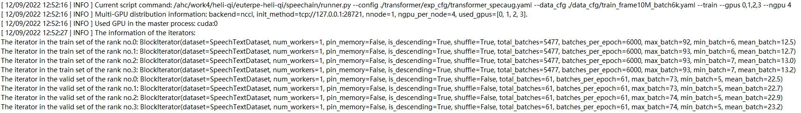
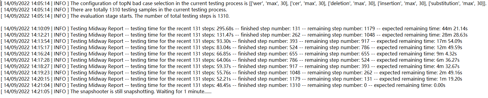
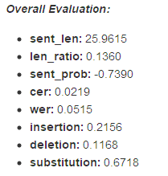
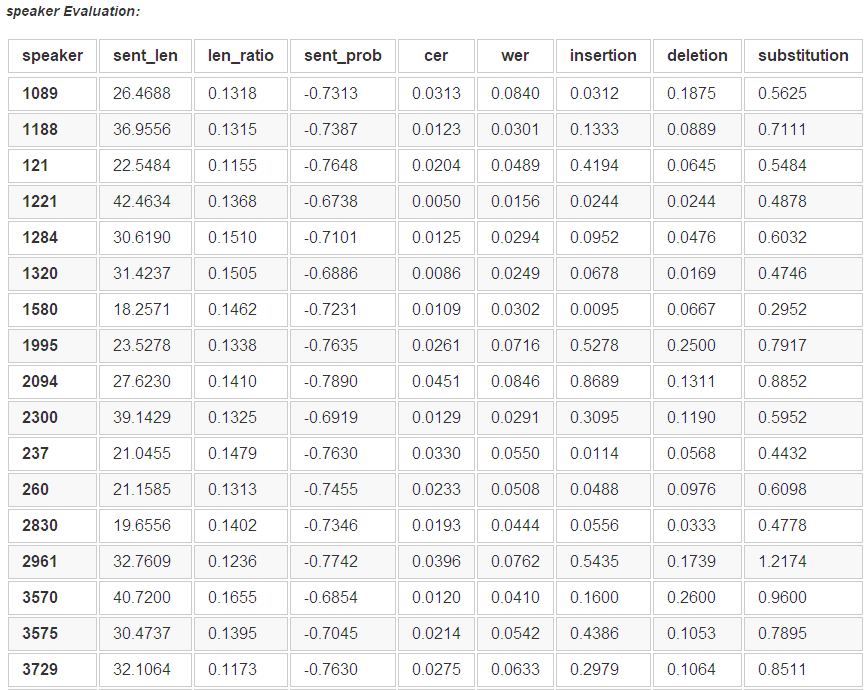
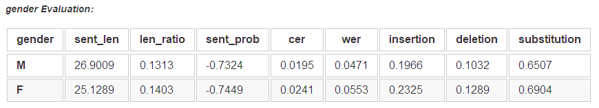
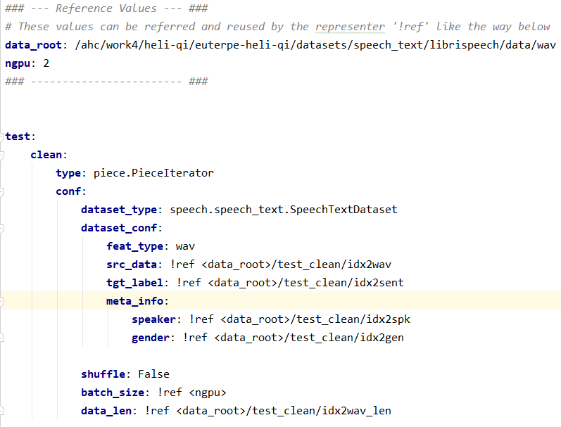
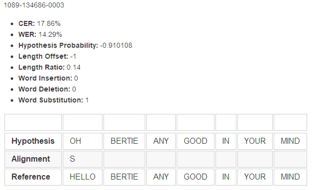
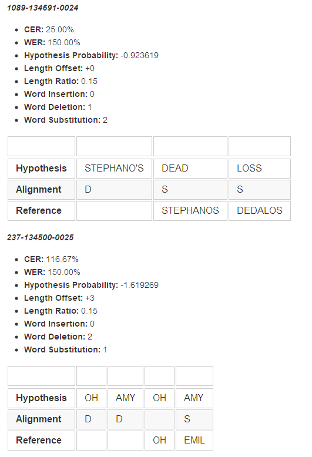

# Recipes Folder of the SpeeChain toolkit
The recipes of the SpeeChain toolkit are grouped by the task. 
Each task has a sub-folder in */recipes/*. 
In the sub-folder of each task, each dataset has a second-level sub-folder.

👆[Back to the home page](https://github.com/ahclab/SpeeChain#the-speechain-toolkit)

## Available Recipes
### [Speech Recognition](https://github.com/ahclab/SpeeChain/tree/main/recipes/asr)
1. [LibriSpeech](https://github.com/ahclab/SpeeChain/tree/main/recipes/asr/librispeech)
2. [LJSpeech](https://github.com/ahclab/SpeeChain/tree/main/recipes/asr/ljspeech)

### [Speech Synthesis]()

### [Speaker Recognition]()

## Experiment Results Structure
The structure of the result files in an experiment folder is shown as below:
```
exp/                # the 'exp' folder of each model
    exp_name/           # the name of a specific experiment
        test_cfg_name/      # the name of a testing configuration file
            test_model_name/    # the name of the model you want to test the performance
                test_set_name/      # the name of a test set
                    figures/                # the folder that contains all the distribution figures of each metric on the test set
                    test.log                # the log file that contains the testing process of a specific test set
                    overall_results.md      # the .md file that contains the model overall performance on the test set
                    sample_reports.md       # the .md file that contains the detailed performance reports of each testing sample
                    topn_(max/min)_xxx.md   # the .md file that contains the top-n bad cases selected by the metric 'xxx'
                    idx2xxx                 # the files that contains individual metrics of each testing sample, a file corresponds to a metric 'xxx'
                ...                 # other test sets
            ...                 # other test models
        ...                 # other test configurations
        
        models/             # this sub-folder contains all the model files
            N_xxx_average.mdl   # the average model obtained by the metric 'xxx' on 'N' best models
            xxx_best.mdl        # the pointer to the best model obtained by the metric 'xxx'
            xxx_best_2.mdl      # the pointer to the second best model obtained by the metric 'xxx'
            ...                
            xxx_best_n.mdl      # the pointer to the n-th best model obtained by the metric 'xxx'  
            epoch_X.mdl         # the actual model file of the X-th epoch
            epoch_Y.mdl         # the actual model file of the Y-th epoch
            ...          

        figures/            # this sub-folder contains all the snapshotting figures made
            train/              # the snapshotting figures made during training
                ...
            valid/              # the snapshotting figures made during validation
                ...

        tensorboard/        # this sub-folder contains the writer events for tensorboard visualization 
        checkpoint.pth      # the checkpoint of the training process so far, used for resuming the training process
        data_cfg.yaml       # the data loading configuration for the experiment, used for resuming the training process
        exp_cfg.yaml        # the experiment environment configuration for the experiment, used for resuming the training process
        train_cfg.yaml      # the moder and optimizer configuration for the experiment, used for resuming the training process
        train.log           # the log file that contains the training process of the given training sets and validation sets
```

## Result File Exhibition
### train.log
#### Environment Information

At the beginning of _train.log_, the GPU and iterator information are given as the figure shown above.

#### Model Information
  
Then, the detailed model information followed parameter statistics are given as the figure shown above.

#### Epoch Information
   
Finally, the mini-report of each epoch is given as the figure shown above. 
The mini-reports are divided into two parts: training part and validation part, 
each of which contains a summary of the overall information of the entire epoch. 
In the training part, the step-level information will be shown in real time; 
in the validation part, the evaluation result of the current epoch will be shown to users.

### test.log

In _test.log_, the number of overall testing samples and testing steps will be first given. 
Then, the step-level testing midway reports are given in real time to keep users aware of how the testing is going. 
In each mini-report, the expected remaining time is given to inform users of how long the testing will last. 
The remaining time is calculated by the moving average of the recorded consuming time of the past steps.

### overall_results.md

#### overall performance
  
At the beginning of _overall_results.md_, the overall model performance on the entire testing set is given as the figure shown above. 
The results are given in a list and each numerical metric corresponds to a row.

#### (optional) group-wise performance

  

If _meta_info_ is given in the data loading configuration of the test set as the figure shown below, the group-wise model performance will be given as a table where each row is a group and each column is a numerical metric. 
The group name is the same with the key names in your given _meta_info_.  



### sample_reports.md
  
The detailed report of each testing sample will also be given as the figure shown above. 
In this example of ASR model report, besides the numerical metrics, the alignment between hypothesis and reference will also be shown to users for the purpose of diagnosing.

### topN_(max/min)_xxx.md
  
Our toolkit also shows the top-n bad cases to users for better model diagnose. 
The top-n bad cases can be selected by any numerical metric in either the ascending order (min) or the descending order (max). 
The layout of _topN_(max/min)_xxx.md_ is exactly the same with _sample_reports.md_.