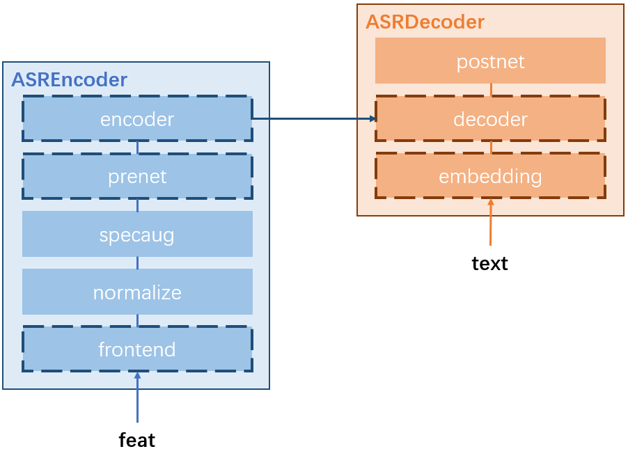

# Automatic Speech Recognition (ASR)

## Table of Contents
1. [Model Structure]()
2. [Configuration Format]()
3. [Available Backbones]()
4. [API Document]()

## Model Structure


The neural network structure of an `ASR` _Model_ object is made up of two _Module_ members: an `ASREncoder` _Module_ object and an `ASRDecoder` _Module_ object.
1. `ASREncoder` is made up of:
   1. `frontend` converts the raw waveforms into acoustic features on-the-fly.
   2. `normalize` normalizes the extracted acoustic features to normal distribution for faster convergence.
   3. `specaug` randomly warps and masks the normalized acoustic features.
   4. `prenet` preprocesses the augmented acoustic features before passing them to the encoder.
   5. `encoder` extracts the encoder hidden representations of the preprocessed acoustic features and passes them to `ASRDecoder`.
2. `ASRDecoder` is made up of:
   1. `embedding` embeds each tokens in the input sentence into token embedding vectors.
   2. `decoder` extracts the decoder hidden representations based on the token embedding vectors and encoder hidden representations.
   3. `postnet` predicts the probability of the next tokens by the decoder hidden representations.

The concrete implementation classes of the blocks with dashed edges can be freely selected among the available options in the _Dict_ members `{block_name}_class_dict` of `ASREncoder` and `ASRDecoder`.

## Configuration Format
```
model:
    customize_conf:
        token_type: ...
        token_vocab: ...
        sample_rate: (optional) 
        audio_format: (optional)
    module_conf:
         frontend:
            type: ...
            conf:
                ...
         normalize:
            ...
         specaug:
            ...
         enc_prenet:
            type: ...
            conf:
                ...
         encoder:
            type: ...
            conf:
                ...
         dec_emb:
            type: ...
            conf:
                ...
         decoder:
            type: ...
            conf:
                ...
    criterion_conf:
        is_normalized: (optional)
        label_smoothing: (optional)
```

## Available Backbones
1. Speech-Transformer ([paper reference](https://ieeexplore.ieee.org/abstract/document/8462506))
    ```
    frontend:
        type: mel_fbank
        conf:
            ...
    enc_prenet:
        type: conv2d
        conf:
            ...
    encoder:
        type: transformer
        conf:
            ...
    dec_emb:
        type: emb
        conf:
            ...
    decoder:
        type: transformer
        conf:
            ...
    ```
3. Paraformer ([paper reference](https://arxiv.org/pdf/2206.08317), coming soon~)

## API Document
1. [speechain.model.asr.ASR.module_init]()
2. [speechain.model.asr.ASR.criterion_init]()
3. [speechain.model.asr.ASR.inference]()

### speechain.model.asr.ASR.module_init()
* **Description:**  
    This initialization function contains three steps: 
    1. `Tokenizer` initialization. 
    2. `ASREncoder` initialization.
    3. `ASRDecoder` initialization.  
    
    The input arguments of this function are two-fold:
    1. the ones from `customize_conf` of `model` in `train_cfg`
    2. the ones from `module_conf` of `model` in `train_cfg`
* **Arguments:**  
  _Arguments from `customize_conf`:_  
  * _**token_type:**_ str  
    The type of the built-in tokenizer.  
    Currently, we support 'char' for `CharTokenizer` and 'subword' for `SubwordTokenizer`.
  * _**token_vocab:**_ str  
    The path of the vocabulary list `vocab` for initializing the built-in tokenizer.
  * _**sample_rate:**_ int = 16000  
    The sampling rate of the input speech.  
    Currently, it's used for acoustic feature extraction frontend initialization and tensorboard register of the input speech for model visualization.  
    In the future, this argument will also be used to on-the-fly downsample the input speech.
  * _**audio_format:**_ str == 'wav'   
    This argument is only used for input speech recording during model visualization.

  _Arguments from `module_conf`:_  
  * _**frontend:**_ Dict  
    The configuration of the acoustic feature extraction frontend in the `ASREncoder` member.
    This argument must be given since our toolkit doesn't support time-domain ASR.  
    For more details about how to give `frontend`, please refer to [speechain.module.encoder.asr.ASREncoder]().
  * _**enc_prenet:**_ Dict  
    The configuration of the prenet in the `ASREncoder` member.  
    For more details about how to give `enc_prent`, please refer to [speechain.module.encoder.asr.ASREncoder]().
  * _**encoder:**_ Dict  
    The configuration of the encoder main body in the `ASREncoder` member.  
    For more details about how to give `encoder`, please refer to [speechain.module.encoder.asr.ASREncoder]().
  * _**dec_emb:**_ Dict  
    The configuration of the embedding layer in the `ASRDecoder` member. 
    For more details about how to give `dec_emb`, please refer to [speechain.module.decoder.asr.ASRDecoder]().
  * _**decoder:**_ Dict  
    The configuration of the decoder main body in the `ASRDecoder` member.  
    For more details about how to give `decoder`, please refer to [speechain.module.decoder.asr.ASRDecoder]().
  * _**normalize:**_ Dict or bool = None  
    The configuration of the normalization layer in the `ASREncoder` member.  
    This argument can also be given as a bool value. True means the default configuration and False means no normalization.  
    For more details about how to give `normalize`, please refer to [speechain.module.norm.feat_norm.FeatureNormalization]().
  * _**specaug:**_ Dict or bool = None  
    The configuration of the SpecAugment layer in the `ASREncoder` member.  
    This argument can also be given as a bool value. True means the default configuration and False means no SpecAugment.  
    For more details about how to give `specaug`, please refer to [speechain.module.augment.specaug.SpecAugment]().
  

### speechain.model.asr.ASR.criterion_init()
* **Description:**  
    This function initializes all the necessary _Criterion_ members:
    1. `speechain.criterion.cross_entropy.CrossEntropy` for training loss calculation.
    2. `speechain.criterion.accuracy.Accuracy` for teacher-forcing validation accuracy calculation.
    3. `speechain.criterion.error_rate.ErrorRate` for evaluation CER & WER calculation.
* **Arguments:**
  * _**is_normalized:**_ bool = False  
    Controls whether the sentence normalization is performed.  
    For more details, please refer to [speechain.criterion.cross_entropy.CrossEntropy]()
  * _**label_smoothing:**_ float = 0.0  
    Controls the scale of label smoothing. 0 means no smoothing.  
    For more details, please refer to [speechain.criterion.cross_entropy.CrossEntropy]()
    

### speechain.model.asr.ASR.inference()
* **Description:**  
  The inference function for ASR models. There are two steps in this function:
    1. Decode the input speech into hypothesis transcript
    2. Evaluate the hypothesis transcript by the ground-truth  

  This function can be called for model evaluation, on-the-fly model visualization, and even pseudo transcript generation during training.
* **Arguments:**  
  _Arguments from `self.evaluate()`:_  
  * _**infer_conf:**_ Dict  
    The inference configuration given from the `infer_cfg` in your `exp_cfg`.  
    For more details, please refer to [speechain.infer_func.beam_search.beam_searching]().
  * _**feat:**_ torch.Tensor  
    The speech data to be inferred.
  * _**feat_len:**_ torch.Tensor  
    The length of `feat`.
  * _**text:**_ torch.Tensor  
    The ground-truth transcript for the input speech
  * _**text_len:**_ torch.Tensor  
    The length of `text`.
  
  _Arguments given by other functions:_  
  * _**domain:**_ str = None   
    This argument indicates which domain the input speech belongs to.  
    It's used to indicate the `ASREncoder` member how to encode the input speech.
  * _**return_att:**_ bool = False  
    Whether the attention matrix of the input speech is returned.
  * _**decode_only:**_ bool = False  
    Whether skip the evaluation step and do the decoding step only.
  * _**teacher_forcing:**_ bool = False  
    Whether you use the teacher-forcing technique to generate the hypothesis transcript.
* **Return:** Dict  
    A Dict containing all the decoding and evaluation results.
