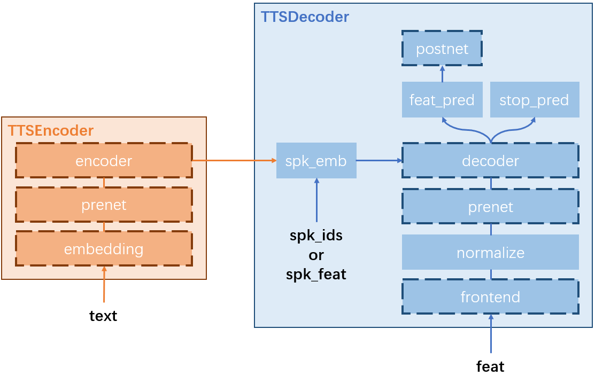

# Text-To-Speech Synthesis (TTS)

👆[Back to the recipe README.md](https://github.com/ahclab/SpeeChain/tree/main/recipes#recipes-folder-of-the-speechain-toolkit)

## Table of Contents
1. [Model Structure](https://github.com/ahclab/SpeeChain/tree/main/recipes/tts#model-structure)
2. [Configuration Format](https://github.com/ahclab/SpeeChain/tree/main/recipes/tts#configuration-format)
3. [Available Backbones](https://github.com/ahclab/SpeeChain/tree/main/recipes/tts#available-backbones)
4. [API Document](https://github.com/ahclab/SpeeChain/tree/main/recipes/tts#api-document)

## Model Structure


The neural network structure of an `TTS` _Model_ object is made up of an `TTSEncoder` _Module_ object and an `TTSDecoder` _Module_ object.
1. `TTSEncoder` is made up of:
   1. `embedding` embeds each tokens in the input sentence into token embedding vectors.
   2. `prenet` preprocesses the token embedding vectors before passing them to the encoder.
   3. `encoder` extracts the encoder hidden representations of the preprocessed token embeddings and passes them to `TTSDecoder`.
2. `TTSDecoder` is made up of:
   1. `frontend` converts the raw waveforms into acoustic features on-the-fly.
   2. `normalize` normalizes the extracted acoustic features to normal distribution for faster convergence.
   3. `prenet` pre-processes the normalized acoustic features before passing them to the decoder.
   4. `spk_emb` extracts speaker embedding vectors and combines them into encoder hidden representations.
   5. `decoder` extracts the decoder hidden representations based on the preprocessed acoustic features and encoder hidden representations.
   6. `feat_pred` predicts the next-step acoustic features based on the decoder hidden representations.
   7. `stop_pred` predicts the next-step stop flags based on the decoder hidden representations.
   8. `postnet` post-processes the predicted next-step acoustic features.

The concrete implementation classes of the blocks with dashed edges can be freely selected among the available options in the _Dict_ members `{block_name}_class_dict` of `TTSEncoder` and `TTSDecoder`.

👆[Back to the table of contents](https://github.com/ahclab/SpeeChain/tree/main/recipes/tts#table-of-contents)

## Configuration Format
```
model:
    customize_conf:
        token_type: ...
        token_vocab: ...
        reduction_factor: ...
        stop_threshold: ...
        spk_list: (optional)
        sample_rate: (optional)
        audio_format: (optional)
    module_conf:
        enc_emb:
            type: ...
            conf:
                ...
        enc_prenet:
            type: ...
            conf:
                ...
        encoder:
            type: ...
            conf:
                ...
        frontend:
            type: ...
            conf:
                ...
        spk_emb: (optional)
            ...
        dec_prenet:
            type: ...
            conf:
                ...
        decoder:
            type: ...
            conf:
                ...
        dec_postnet:
            type: ...
            conf:
                ...
        vocoder: (not available yet~~~)
            type: ...
            conf:
                ...
    criterion_conf:
        feat_loss_type: ...
        feat_loss_norm: ...
        feat_update_range: ...
        stop_pos_weight: ...
        stop_loss_norm: ...
        f_beta: ...
```

👆[Back to the table of contents](https://github.com/ahclab/SpeeChain/tree/main/recipes/tts#table-of-contents)

## Available Backbones
1. Transformer-TTS ([paper reference](https://ojs.aaai.org/index.php/AAAI/article/view/4642/4520))
    ```
    frontend:
        type: mel_fbank
        conf:
            ...
    enc_emb:
        type: emb
        conf:
            ...
    enc_prenet:
        type: conv1d
        conf:
            ...
    encoder:
        type: transformer
        conf:
            ...
    dec_prenet:
        type: linear
        conf:
            ...
    spk_emb: (required for multi-speaker TTS)
        ...
    decoder:
        type: transformer
        conf:
            ...
    dec_postnet:
        type: conv1d
        conf:
            ...
    ```
2. FastSpeech2 ([paper reference](https://arxiv.org/pdf/2006.04558), coming soon~)

👆[Back to the table of contents](https://github.com/ahclab/SpeeChain/tree/main/recipes/tts#table-of-contents)

## API Document
1. [speechain.model.tts.TTS.module_init](https://github.com/ahclab/SpeeChain/tree/main/recipes/tts#speechainmodelttsttsmodule_init)
2. [speechain.model.tts.TTS.criterion_init](https://github.com/ahclab/SpeeChain/tree/main/recipes/tts#speechainmodelttsttscriterion_init)
3. [speechain.model.tts.TTS.inference](https://github.com/ahclab/SpeeChain/tree/main/recipes/tts#speechainmodelttsttsinference)

### speechain.model.tts.TTS.module_init()
* **Description:**  
    This initialization function contains four steps: 
    1. `Tokenizer` initialization. 
    2. `TTSEncoder` initialization.
    3. `TTSDecoder` initialization. 
    4. `Vocoder` initialization.
    
    The input arguments of this function are two-fold:
    1. the ones from `customize_conf` of `model` in `train_cfg`
    2. the ones from `module_conf` of `model` in `train_cfg`
* **Arguments:**  
  _Arguments from `customize_conf`:_  
  * _**token_type:**_ str  
    The type of the built-in tokenizer.  
    Currently, we support 'char' for `CharTokenizer` and 'phn' for `PhonemeTokenizer`.
  * _**token_vocab:**_ str  
    The path of the vocabulary list `vocab` for initializing the built-in tokenizer.
  * _**reduction_factor:**_ int = 1  
    How many frames your TTS model predict at each time step.
  * _**stop_threshold:**_ float = 0.5  
    The threshold that controls whether the speech synthesis stops or not.
  * _**spk_list:**_ str  
    The path of the speaker list that contains all the speaker ids in your training set.  
    If you would like to train a close-set multi-speaker TTS, you need to give a spk_list.
  * _**sample_rate:**_ int = 22050  
    The sampling rate of the input speech.  
    Currently, it's used for acoustic feature extraction frontend initialization and tensorboard register of the input speech for model visualization.  
    In the future, this argument will also be used to on-the-fly downsample the input speech.
  * _**audio_format:**_ str = 'wav'  
    This argument is only used for input speech recording during model visualization.
  
  _Arguments from `module_conf`:_  
  * _**frontend:**_ Dict  
    The configuration of the acoustic feature extraction frontend in the `TTSDecoder` member.  
    This argument must be given since our toolkit doesn't support time-domain TTS.  
    For more details about how to give `frontend`, please refer to [speechain.module.encoder.tts.TTSDecoder](https://github.com/ahclab/SpeeChain/blob/main/speechain/module/decoder/tts.py#L27).
  * _**enc_emb:**_ Dict  
    The configuration of the embedding layer in the `TTSEncoder` member.  
    For more details about how to give `enc_emb`, please refer to [speechain.module.encoder.tts.TTSEncoder](https://github.com/ahclab/SpeeChain/blob/main/speechain/module/encoder/tts.py#L20).
  * _**enc_prenet:**_ Dict  
    The configuration of the prenet in the `TTSEncoder` member.  
    For more details about how to give `enc_prent`, please refer to [speechain.module.encoder.tts.TTSEncoder](https://github.com/ahclab/SpeeChain/blob/main/speechain/module/encoder/tts.py#L20).
  * _**encoder:**_ Dict  
    The configuration of the encoder main body in the `TTSEncoder` member.  
    For more details about how to give `encoder`, please refer to [speechain.module.encoder.tts.TTSEncoder](https://github.com/ahclab/SpeeChain/blob/main/speechain/module/encoder/tts.py#L20).
  * _**spk_emb:**_ Dict  
    The configuration for the `SPKEmbedPrenet` in the `TTSDecoder` member. 
    For more details about how to give `spk_emb`, please refer to [speechain.module.prenet.spk_embed.SpeakerEmbedPrenet](https://github.com/ahclab/SpeeChain/blob/main/speechain/module/prenet/spk_embed.py#L9).
  * _**dec_prenet:**_ Dict  
    The configuration of the prenet in the `TTSDecoder` member.  
    For more details about how to give `dec_prenet`, please refer to [speechain.module.encoder.tts.TTSDecoder](https://github.com/ahclab/SpeeChain/blob/main/speechain/module/decoder/tts.py#L27).
  * _**decoder:**_ Dict  
    The configuration of the decoder main body in the `TTSDecoder` member.  
    For more details about how to give `decoder`, please refer to [speechain.module.decoder.tts.TTSDecoder](https://github.com/ahclab/SpeeChain/blob/main/speechain/module/decoder/tts.py#L27).
  * _**dec_postnet:**_ Dict  
    The configuration of the postnet in the `TTSDecoder` member.  
    For more details about how to give `dec_postnet`, please refer to [speechain.module.encoder.tts.TTSDecoder](https://github.com/ahclab/SpeeChain/blob/main/speechain/module/decoder/tts.py#L27).
  * _**normalize:**_ Dict = None  
    The configuration of the normalization layer in the `TTSDecoder` member.  
    This argument can also be given as a bool value. 
    True means the default configuration and False means no normalization.  
    For more details about how to give `normalize`, please refer to [speechain.module.norm.feat_norm.FeatureNormalization](https://github.com/ahclab/SpeeChain/blob/main/speechain/module/norm/feat_norm.py#L11).
  * _**vocoder:**_ Dict = None  
    The configuration of the vocoder member.
  
👆[Back to the API list](https://github.com/ahclab/SpeeChain/tree/main/recipes/tts#api-document)

### speechain.model.tts.TTS.criterion_init()
* **Description:**  
    This function initializes all the necessary _Criterion_ members:
    1. `speechain.criterion.least_error.LeastError` for acoustic feature prediction loss calculation.
    2. `speechain.criterion.bce_logits.BCELogits` for stop flag prediction loss calculation.
    3. `speechain.criterion.accuracy.Accuracy` for teacher-forcing stop flag prediction accuracy calculation.
    4. `speechain.criterion.fbeta_score.FBetaScore` for teacher-forcing stop flag prediction f-score calculation.
* **Arguments:**
  * _**feat_loss_type:**_ str = 'L2'  
    The type of acoustic feature prediction loss. Should be either 'L1', 'L2', and 'L1+L2'.  
    For more details, please refer to [speechain.criterion.least_error.LeastError](https://github.com/ahclab/SpeeChain/blob/main/speechain/criterion/least_error.py#L16).
  * _**feat_loss_norm:**_ bool = True  
    Controls whether the sentence normalization is performed for feature loss calculation.  
    For more details, please refer to [speechain.criterion.least_error.LeastError](https://github.com/ahclab/SpeeChain/blob/main/speechain/criterion/least_error.py#L16).
  * _**feat_update_range:**_ int or float = None  
    The updating range of the dimension of acoustic features for feature loss calculation.  
    For more details, please refer to [speechain.criterion.least_error.LeastError](https://github.com/ahclab/SpeeChain/blob/main/speechain/criterion/least_error.py#L16).
  * _**stop_pos_weight:**_ float = 5.0  
    The weight putted on stop points for stop loss calculation.  
    For more details, please refer to [speechain.criterion.bce_logits.BCELogits](https://github.com/ahclab/SpeeChain/blob/main/speechain/criterion/bce_logits.py#L16).
  * _**stop_loss_norm:**_ bool = True  
    Controls whether the sentence normalization is performed for stop loss calculation.  
    For more details, please refer to [speechain.criterion.bce_logits.BCELogits](https://github.com/ahclab/SpeeChain/blob/main/speechain/criterion/bce_logits.py#L16).
  * _**f_beta:**_ int = 2  
    The value of beta for stop flag f-score calculation.  
    The larger beta is, the more f-score focuses on true positive stop flag prediction result.  
    For more details, please refer to [speechain.criterion.fbeta_score.FBetaScore](https://github.com/ahclab/SpeeChain/blob/main/speechain/criterion/fbeta_score.py#L12).

👆[Back to the API list](https://github.com/ahclab/SpeeChain/tree/main/recipes/tts#api-document)

### speechain.model.tts.TTS.inference()
* **Description:**  
    The inference function for TTS models. There are two steps in this function:
    1. Decode the input text into hypothesis utterance
    2. Evaluate the hypothesis utterance by the ground-truth  

  This function can be called for model evaluation, on-the-fly model visualization, and even pseudo utterance generation during training.
* **Arguments:**  
  _Arguments from `self.evaluate()`:_  
  * _**infer_conf:**_ Dict  
    The inference configuration given from the `infer_cfg` in your `exp_cfg`.  
    For more details, please refer to [speechain.infer_func.tts_decoding.auto_regression](https://github.com/ahclab/SpeeChain/blob/main/speechain/infer_func/tts_decoding.py#L11).
  * _**text:**_ torch.Tensor  
    The text data to be inferred.
  * _**text_len:**_ torch.Tensor  
    The length of `text`.
  * _**feat:**_ torch.Tensor  
    The ground-truth utterance for the input text.  
    Used for teacher-forcing decoding and objective evaluation
  * _**feat_len:**_ torch.Tensor  
    The length of `feat`.
  * _**spk_ids:**_ torch.Tensor  
    The ID of the reference speaker.
  * _**spk_feat:**_ torch.Tensor  
    The speaker embedding of the reference speaker.

  _Arguments given by other functions:_  
  * _**aver_spk:**_ bool = False  
    Whether you use the average speaker as the reference speaker. 
    The speaker embedding of the average speaker is a zero vector.
  * _**return_att:**_ bool = False  
    Whether the attention matrix of the input speech is returned.
  * _**feat_only:**_ bool = False  
    Whether only decode the text into acoustic features without vocoding.
  * _**decode_only:**_ bool = False  
    Whether skip the evaluation step and do the decoding step only.
  * _**use_dropout:**_ bool = False  
    Whether turn on the dropout layers in the prenet of the TTS decoder when decoding.
  * _**use_before:**_ bool = False  
    Whether you use the predicted acoustic features before the postnet of the TTS decoder as the prediction results.
  * _**teacher_forcing:**_ bool = False  
    Whether you use the teacher-forcing technique to generate the hypothesis utterance.
* **Return:** Dict  
    A Dict containing all the decoding and evaluation results.

👆[Back to the API list](https://github.com/ahclab/SpeeChain/tree/main/recipes/tts#api-document)

👆[Back to the table of contents](https://github.com/ahclab/SpeeChain/tree/main/recipes/tts#table-of-contents)
